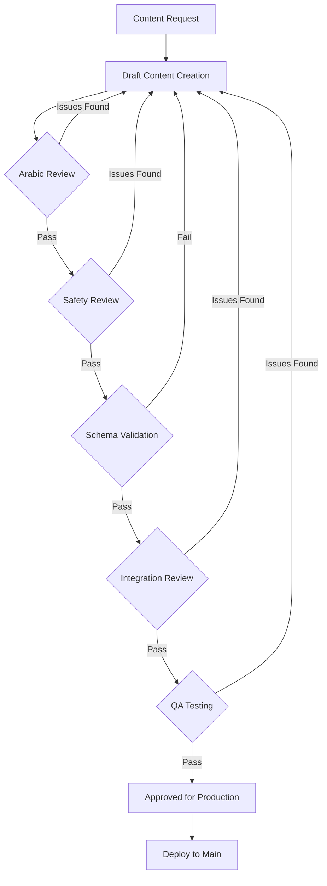

# Content Governance & Safety Maintenance Workflow

> Approval process and maintenance cadence for Arabic DSM-5-TR assessment content

**Last Updated**: 2026-01-30  
**Status**: Active  
**Owner**: Content & QA Team

---

## Overview

This document defines the **content governance workflow** for creating, reviewing, and approving new assessment modules, and the **safety maintenance cadence** for keeping helplines, resources, and disclaimers current.

All mental health content must pass through a multi-stage review process to ensure:
- **Clinical accuracy**: Questions map correctly to DSM-5-TR criteria
- **Language quality**: Arabic content is clear, gentle, and culturally appropriate
- **Safety compliance**: Crisis interventions and disclaimers are present
- **Technical validity**: JSON schema is correct and integrates cleanly
- **Accessibility**: Content is RTL-compatible and screen-reader friendly

---

## Content Governance Workflow

### Workflow Diagram



### Stage 1: Draft Content Creation

**Responsible**: Content Author  
**Deliverable**: Initial JSON module file in `content/<module>/` folder

**Requirements**:
- Map questions to specific DSM-5-TR criteria (document in `docs/discovery/05_criteria_mapping.md`)
- Include educational intros (gentle, non-clinical language)
- Define response scales (5-point frequency, duration, impairment, etc.)
- Add conditional logic where appropriate
- Flag high-risk questions (`risk_flag: "CRITICAL"` for suicidal ideation)
- Include crisis triggers for any question that may indicate immediate danger

**Resources**:
- Template: Use `content/anxiety/anxiety_module.json` as reference structure
- Criteria mapping: `docs/discovery/05_criteria_mapping.md`
- Language guidelines: `content/safety/safety_disclaimers.json` → `language_guidelines`

---

### Stage 2: Arabic Language Review

**Responsible**: Native Arabic speaker (clinical or educational background preferred)  
**Goal**: Ensure language is clear, culturally appropriate, and supportive

**Checklist**:
- [ ] Arabic grammar is correct (MSA standard)
- [ ] Tone is gentle and supportive (not clinical or judgmental)
- [ ] No jargon or overly technical terms
- [ ] Educational intros are accessible to general audience
- [ ] Questions are unambiguous and easy to understand
- [ ] RTL formatting is correct (no LTR punctuation issues)
- [ ] Cultural sensitivity is maintained (e.g., family dynamics, stigma considerations)

**Common Issues**:
- ❌ Using diagnostic terminology in user-facing text (e.g., "تشخيص" → use "فهم" or "تقييم ذاتي")
- ❌ Direct translations that sound unnatural in Arabic
- ❌ Overly formal or medical language
- ✅ Use conversational, empathetic phrasing
- ✅ Frame questions as self-reflection, not interrogation

**Approval**: Arabic reviewer signs off in PR review or change log

---

### Stage 3: Safety Review

**Responsible**: Safety Lead or Clinical Advisor  
**Goal**: Verify crisis interventions and risk mitigation are in place

**Checklist**:
- [ ] High-risk questions have `risk_flag` and `crisis_trigger` defined
- [ ] Crisis modal appears for suicidal ideation responses (`>=1` on any frequency)
- [ ] Persistent crisis footer is enabled for high-risk sessions
- [ ] Disclaimers are present (pre-assessment, results screen)
- [ ] Educational content does not give false hope or minimize risk
- [ ] Professional referral language is clear and non-judgmental
- [ ] Helplines are current and regionally appropriate

**High-Risk Question Checklist** (for questions flagged as `CRITICAL`):
- [ ] Question text is sensitive and non-triggering
- [ ] Response scale allows user to indicate frequency/severity
- [ ] Crisis modal appears immediately after non-zero response
- [ ] Modal includes regional helplines and professional referral
- [ ] User can continue or exit assessment from modal
- [ ] Persistent crisis footer remains visible for rest of session

**Approval**: Safety Lead signs off in PR review or change log

---

### Stage 4: Schema Validation

**Responsible**: QA Agent or Developer  
**Goal**: Ensure JSON structure is valid and integrates with frontend

**Checklist**:
- [ ] JSON file is valid (no syntax errors)
- [ ] Required fields are present (`id`, `text`, `response_type`, `criterion`)
- [ ] Response scales match defined scales in `response_scales` section
- [ ] Conditional logic references valid question IDs
- [ ] Crisis triggers reference valid modal types in `safety_disclaimers.json`
- [ ] No duplicate question IDs within module
- [ ] Educational sections follow structure (`title`, `body`, `key_points`)

**Validation Command**:
```bash
# Run JSON schema validation (Phase 2: automated CI)
npm run validate:content

# Manual check for now
cat content/<module>/<module>_module.json | jq . > /dev/null
```

**Approval**: Schema validation passes (automated in CI pipeline for Phase 2+)

---

### Stage 5: Integration Review

**Responsible**: Frontend Developer  
**Goal**: Verify content integrates cleanly with assessment engine

**Checklist**:
- [ ] Module loads correctly in category browser
- [ ] Questions render in correct order
- [ ] Response components match `response_type` (radio, slider, multi-select, etc.)
- [ ] Conditional logic hides/shows questions as expected
- [ ] Crisis modal triggers correctly
- [ ] Educational intros display before questions
- [ ] Results calculation works (pattern detection logic)
- [ ] PDF export includes new module content

**Test Scenarios**:
1. Complete module from start to finish (happy path)
2. Test conditional branches (if question depends on prior answer)
3. Trigger crisis modal (if applicable)
4. Verify RTL layout and typography
5. Test with screen reader (accessibility)

**Approval**: Developer signs off in PR review after manual testing

---

### Stage 6: QA Testing

**Responsible**: QA Agent  
**Goal**: End-to-end regression and accessibility audit

**Checklist**:
- [ ] Full regression test (all modules still work)
- [ ] New module completes without errors
- [ ] Crisis intervention works as expected
- [ ] Results screen shows appropriate feedback
- [ ] PDF export includes new content
- [ ] No console errors or warnings
- [ ] WCAG 2.1 AA compliance (accessibility)
- [ ] RTL layout is correct on mobile/tablet/desktop
- [ ] Keyboard navigation works
- [ ] Screen reader announces content correctly

**Testing Tools**:
- axe DevTools (automated accessibility scan)
- Manual WCAG audit (`outputs/QA_ACCESSIBILITY_AUDIT_REPORT_*.md` template)
- Cross-browser testing (Chrome, Firefox, Safari, Edge)
- Mobile device testing (iOS Safari, Android Chrome)

**Approval**: QA Agent creates audit report and signs off in PR review

---

### Stage 7: Production Approval

**Responsible**: Project Lead or Product Owner  
**Approval**: Final sign-off to merge PR and deploy to main

**Final Checklist**:
- [ ] All prior stages have passed
- [ ] Change log is updated (see template below)
- [ ] README files are updated (`content/README.md` and module-specific docs)
- [ ] PR description includes summary of changes and review notes
- [ ] No breaking changes to existing modules
- [ ] Deployment plan is clear (immediate merge or scheduled release)

**Deployment**: Merge PR to `main` branch → auto-deploy to production (Vercel)

---

## Content Approval Checklist (Quick Reference)

Use this checklist in PR reviews or change logs to track approval status:

```markdown
## Content Approval Checklist

**Module**: `[module_name]` (e.g., `ocd_module.json`)  
**Author**: [Name]  
**Date Submitted**: [YYYY-MM-DD]

### Review Stages

- [ ] **Draft Complete** — Initial content created and mapped to DSM-5-TR criteria
- [ ] **Arabic Review** — Native speaker approved language quality and cultural sensitivity
- [ ] **Safety Review** — Clinical advisor verified crisis interventions and risk mitigation
- [ ] **Schema Validation** — JSON structure is valid and matches schema
- [ ] **Integration Review** — Developer confirmed clean integration with frontend
- [ ] **QA Testing** — Regression and accessibility testing passed
- [ ] **Production Approval** — Final sign-off from project lead

### Approvers

- **Arabic Reviewer**: [Name] — Approved on [Date]
- **Safety Lead**: [Name] — Approved on [Date]
- **QA Agent**: [Name] — Approved on [Date]
- **Project Lead**: [Name] — Approved on [Date]

### Notes

[Any special considerations, known limitations, or follow-up items]
```

---

## Safety Maintenance Cadence

### Overview

Safety content requires regular updates to ensure helplines, resources, and disclaimers remain current. This section defines the **maintenance schedule** for ongoing content updates.

---

### Quarterly: Helpline Verification

**Frequency**: Every 3 months (Jan, Apr, Jul, Oct)  
**Responsible**: Safety Lead or Content Maintainer  
**Target File**: `content/safety/safety_disclaimers.json` → `regional_helplines.regions`

**Process**:
1. **Call or verify online** each helpline number (6 regional + international)
2. **Check operating hours** (some helplines are 24/7, others have limited hours)
3. **Update if changed** (new number, discontinued service, new contact method)
4. **Document changes** in change log (see template below)

**Helplines to Verify** (as of Jan 2026):
- **UAE**: Dubai Foundation for Women and Children — `800-111` (24/7)
- **Saudi Arabia**: National Mental Health Helpline — `920-033-360` (24/7)
- **Egypt**: Life Line Egypt — `7621` (SMS) + `16328` (voice, limited hours)
- **Jordan**: Family Guidance and Awareness Center — `+962-6-535-5050` (limited hours)
- **Lebanon**: Embrace Lifeline — `1564` (24/7)
- **International**: Befrienders Worldwide — `www.befrienders.org` (directory)

**Change Log Entry** (if updated):
```markdown
### 2026-04-15 — Helpline Update (Q2 Verification)

**Changed**: Egypt Life Line SMS number updated  
**Old**: `7621`  
**New**: `7625`  
**Reason**: Service migrated to new SMS platform  
**Verified By**: [Safety Lead Name]  
**Status**: ✅ Deployed to production
```

---

### Annual: Resource Link Verification

**Frequency**: Once per year (January)  
**Responsible**: Content Maintainer  
**Target Files**: All educational content with external links (module intros, results templates, UI copy)

**Process**:
1. **Extract all URLs** from content files (grep or manual review)
2. **Check each link** (verify it loads and content is still relevant)
3. **Replace broken links** with updated resources or remove if no replacement exists
4. **Document changes** in change log

**Common Link Types**:
- Mental health org websites (e.g., WHO, NIMH equivalents in Arabic)
- Educational articles on anxiety/depression/ADHD/OCD
- Professional directories (therapist finders, psychiatric services)
- Self-help resources (worksheets, coping strategies)

**Change Log Entry** (if updated):
```markdown
### 2026-01-20 — Annual Resource Link Verification

**Changed**: Replaced outdated WHO Arabic mental health guide link  
**Old**: `https://www.who.int/mental_health/old_guide.pdf`  
**New**: `https://www.who.int/mental_health/2026_guide.pdf`  
**Reason**: 2026 updated edition released  
**Verified By**: [Content Maintainer Name]  
**Status**: ✅ Deployed to production

**Removed**: Link to discontinued anxiety self-help site (anxietycenter.ae)  
**Reason**: Domain expired, no replacement found  
**Action**: Removed reference from `content/anxiety/anxiety_module.json` → `gad.educational_intro.resources`  
**Status**: ✅ Deployed to production
```

---

### As-Needed: Disclaimer and Legal Updates

**Frequency**: As required by legal/regulatory changes  
**Responsible**: Project Lead or Legal Advisor  
**Target Files**: `content/safety/safety_disclaimers.json` (all disclaimer sections)

**Triggers for Update**:
- Change in regional mental health regulations
- New legal requirements for online health content
- User feedback indicating unclear disclaimers
- Clinical best practices evolve (e.g., new DSM-5-TR edition)

**Process**:
1. **Review change requirement** (legal memo, regulatory notice, clinical guideline update)
2. **Draft updated disclaimer** (maintain non-judgmental, accessible tone)
3. **Safety review** (clinical advisor approval)
4. **Legal review** (if required)
5. **Deploy immediately** (critical safety content)
6. **Document in change log**

---

## Content Change Log Template

Use this template to track all content updates. Store change logs in `content/CHANGELOG.md` or as inline comments in PR descriptions.

```markdown
# Content Change Log

## [Version/Date] — [Change Type]

**Module/File**: `content/[module]/[file].json`  
**Change Type**: [New Module | Update | Fix | Maintenance]  
**Date**: [YYYY-MM-DD]  
**Author**: [Name]

### Changes Made

- **Added**: [Description of new content]
- **Updated**: [Description of modified content]
- **Removed**: [Description of deleted content]
- **Fixed**: [Description of bug fix or correction]

### Reason

[Why was this change necessary? Clinical update, user feedback, helpline change, etc.]

### Review Status

- [x] Arabic Review — Approved by [Name] on [Date]
- [x] Safety Review — Approved by [Name] on [Date]
- [x] Schema Validation — Passed on [Date]
- [x] Integration Review — Approved by [Name] on [Date]
- [x] QA Testing — Passed on [Date]
- [x] Production Approval — Approved by [Name] on [Date]

### Deployment

- **Deployed to Main**: [YYYY-MM-DD]
- **Live in Production**: [YYYY-MM-DD]

### Notes

[Any additional context, known issues, or follow-up required]

---
```

### Example Change Log Entry

```markdown
## 2026-01-30 — New Module: OCD Assessment

**Module/File**: `content/ocd/ocd_module.json`  
**Change Type**: New Module  
**Date**: 2026-01-30  
**Author**: Content Team

### Changes Made

- **Added**: OCD module with 3 disorders (OCD, Hoarding, BDD)
- **Added**: 18 questions mapped to DSM-5-TR criteria A-F
- **Added**: Educational intros for each disorder
- **Added**: Multi-select symptom checklist (obsessions and compulsions)

### Reason

Phase 2 roadmap requirement to expand coverage beyond anxiety and depression.

### Review Status

- [x] Arabic Review — Approved by Dr. Layla Hassan on 2026-01-28
- [x] Safety Review — Approved by Dr. Ahmed Noor on 2026-01-29
- [x] Schema Validation — Passed on 2026-01-29
- [x] Integration Review — Approved by Frontend Developer on 2026-01-30
- [x] QA Testing — Passed on 2026-01-30
- [x] Production Approval — Approved by Project Lead on 2026-01-30

### Deployment

- **Deployed to Main**: 2026-01-30
- **Live in Production**: 2026-01-30

### Notes

No high-risk questions in this module (no suicidal ideation triggers). OCD compulsions may cause distress but do not require crisis intervention.

---
```

---

## Roles & Responsibilities

| Role | Responsibilities | Required for Approval |
|------|------------------|----------------------|
| **Content Author** | Draft initial content, map to DSM-5-TR criteria | Draft Complete |
| **Arabic Reviewer** | Review language quality, cultural sensitivity, tone | Arabic Review |
| **Safety Lead** | Verify crisis interventions, disclaimers, risk mitigation | Safety Review |
| **QA Agent** | Schema validation, integration testing, accessibility audit | Schema Validation, QA Testing |
| **Frontend Developer** | Integration review, manual testing | Integration Review |
| **Project Lead** | Final production approval, deployment sign-off | Production Approval |

---

## Tools & Automation (Phase 2+)

### Planned Automation

1. **JSON Schema Validation** — CI pipeline (GitHub Actions)
   - Auto-run on every PR
   - Block merge if schema validation fails

2. **Accessibility Testing** — Automated axe scans
   - Run on every build
   - Report WCAG violations in PR comments

3. **Link Checker** — Annual cron job
   - Extract all URLs from content files
   - Test HTTP status (200 OK)
   - Create GitHub issue if broken links found

4. **Helpline Reminder** — Calendar alerts
   - Quarterly reminder to Safety Lead
   - Checklist auto-posted to Slack/email

### Current Manual Process

Until automation is in place:
- **Schema validation**: Run `cat <file> | jq .` before PR
- **Accessibility testing**: Manual axe DevTools scan
- **Link verification**: Manual quarterly check
- **Helpline verification**: Safety Lead adds to calendar

---

## Related Documentation

- **Content Structure**: `content/README.md`
- **DSM-5-TR Criteria Mapping**: `docs/discovery/05_criteria_mapping.md`
- **Privacy & Safety Framework**: `docs/discovery/03_privacy_framework.md`
- **MVP Implementation Plan**: `docs/planning/mvp_implementation_plan.md`
- **QA Accessibility Audit Template**: `outputs/QA_ACCESSIBILITY_AUDIT_REPORT_*.md`

---

## Questions or Feedback?

For questions about this workflow, contact:
- **Content governance**: Project Lead
- **Safety review process**: Safety Lead or Clinical Advisor
- **Technical integration**: Frontend Developer
- **Accessibility**: QA Agent

**Last Reviewed**: 2026-01-30
