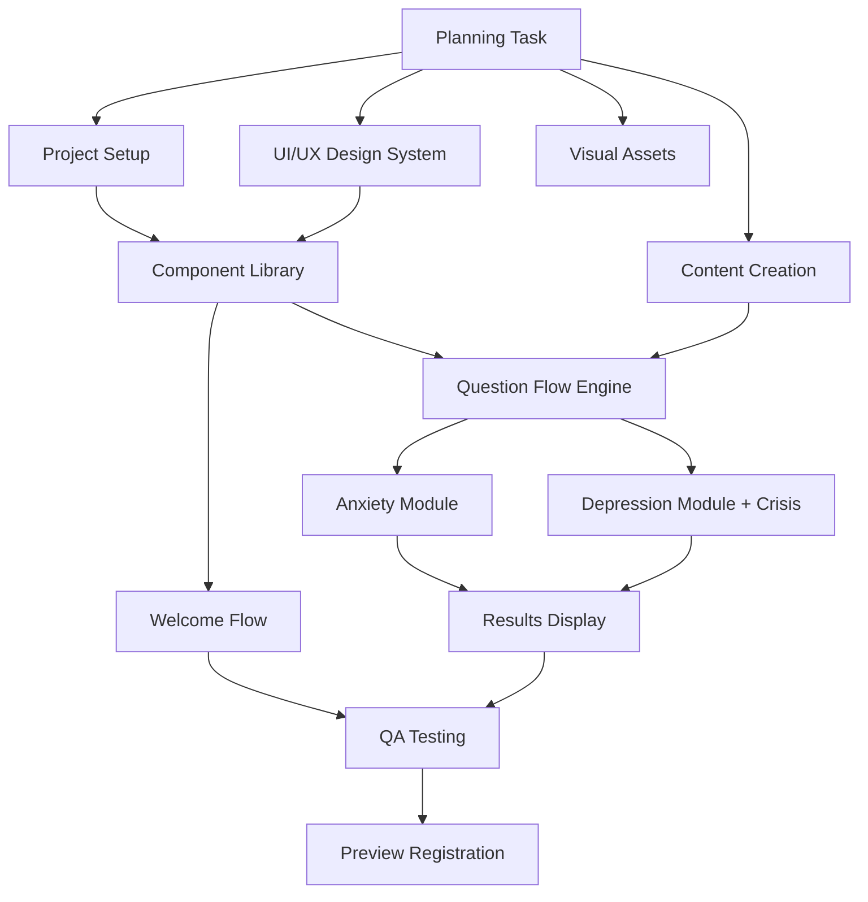

# MVP Phase 1 Implementation Plan

> Generated by Software Planning Agent | 29 January 2026

---

## Executive Summary

This document outlines the implementation plan for the Arabic DSM-5-TR Self-Evaluation Platform MVP (Phase 1). The plan decomposes the MVP into 12 implementation tasks with clear dependencies enabling parallel execution across specialist agents.

### Key Metrics
- **Total Tasks**: 12 implementation tasks
- **Estimated Timeline**: 6-8 weeks
- **Primary Agents**: frontend-developer, ui-ux, image-asset, writing, qa

---

## Architecture Decisions

### Anonymous-First Design
- No backend, no user accounts
- No data persistence (responses stay in session only)
- Maximum privacy for sensitive mental health content

### RTL-Native Implementation
- Arabic-first design using CSS Logical Properties
- Not a mirrored LTR layout
- IBM Plex Sans Arabic primary typography

### Tech Stack
- **Framework**: Next.js 14+ (App Router)
- **Styling**: Tailwind CSS v4 with RTL support
- **Components**: shadcn/ui customised for RTL
- **State**: React Context (session only)
- **Deployment**: Vercel

---

## Task Dependency Graph

---

## Parallel Execution Waves

### Wave 1: Foundation (Week 1-2)
All tasks can start immediately after planning:
- Project Setup (frontend-developer)
- UI/UX Design System (ui-ux)
- Visual Assets (image-asset)
- Content Creation (writing)

### Wave 2: Component Development (Week 2-3)
- RTL Component Library (frontend-developer)
  - Blocked by: Setup, UI/UX

### Wave 3: Core Features (Week 3-4)
- Welcome Flow (frontend-developer)
- Question Flow Engine (frontend-developer)
  - Blocked by: Components, Content

### Wave 4: Assessment Modules (Week 4-6)
Can run in parallel:
- Anxiety Module (frontend-developer)
- Depression Module with Crisis System (frontend-developer)

### Wave 5: Integration (Week 6-7)
- Results Display (frontend-developer)

### Wave 6: Quality Assurance (Week 7-8)
- Accessibility Audit and Testing (qa)

### Wave 7: Deployment (Week 8)
- Preview Registration (frontend-developer)

---

## Critical Path

The critical path runs through:
1. Planning → Setup → Components → Question Flow → Depression Module → Results → QA → Preview

**Depression Module is prioritised over Anxiety** because it includes the critical crisis intervention system for suicidal ideation questions (Criterion A9).

---

## Safety Requirements

### Crisis Intervention System
- Modal triggers on any non-zero response to A9 (suicidal ideation)
- Cannot be dismissed without acknowledgement
- Displays Arabic crisis helpline numbers prominently
- Options: exit assessment or continue with support

### Disclaimers
- Pre-assessment disclaimer (required acceptance)
- In-flow safety reminders
- Results screen disclaimer (not a diagnosis)
- Professional referral encouragement throughout

### Content Safety
- Pattern-based language, never diagnosis language
- No severity labels ("You have severe depression")
- Educational framing throughout
- Gentle, supportive Arabic copy

---

## MVP Scope Boundaries

### In Scope (Phase 1)
- RTL responsive web app (mobile/tablet/desktop)
- Anxiety assessment module (7 disorders)
- Depression assessment module (4 disorders)
- Welcome flow with mood check-in
- Crisis intervention system
- Results with resource links
- AI-generated illustrations
- WCAG 2.1 AA accessibility

### Out of Scope (Phase 2+)
- ADHD and OCD modules
- English language support
- Local storage progress tracking
- PDF export
- Dark mode toggle
- Quick check mode

---

## References

- [Discovery Summary](../discovery/00_discovery_summary.md)
- [Product Options](../discovery/01_product_options.md)
- [RTL Design System](../discovery/02_rtl_design_system.md)
- [Privacy Framework](../discovery/03_privacy_framework.md)
- [MVP Plan](../discovery/04_mvp_plan.md)
- [Criteria Mapping](../discovery/05_criteria_mapping.md)
