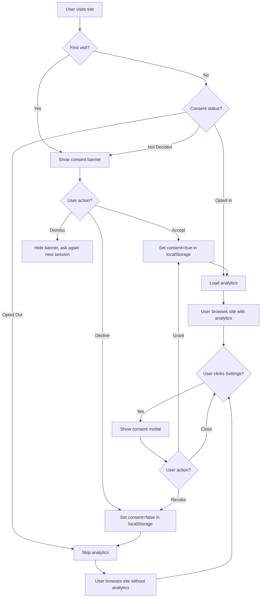

# Analytics Consent UX Specification

**Version**: 1.0.0  
**Date**: 2026-01-29  
**Product**: Arabic DSM-5-TR Self-Evaluation Platform  
**Privacy Framework**: Privacy-First, Anonymous, Opt-In Only  
**Accessibility**: WCAG 2.2 Level AA

---

## Table of Contents

1. [Overview](#overview)
2. [Privacy Principles](#privacy-principles)
3. [Consent Flow Specification](#consent-flow-specification)
4. [Banner Design](#banner-design)
5. [Modal Design](#modal-design)
6. [Behavior When Opted Out](#behavior-when-opted-out)
7. [Technical Implementation Guidance](#technical-implementation-guidance)
8. [Accessibility Requirements](#accessibility-requirements)
9. [Testing & Validation](#testing--validation)

---

## Overview

### Purpose

Define a privacy-first analytics consent UX that aligns with the platform's core principle: **no data collection without explicit user consent**. The consent mechanism must be clear, culturally appropriate for Arabic-speaking users, and fully accessible.

### Scope

- **In scope**: Opt-in consent banner/modal design, placement strategy, Arabic copy, behavior when consent declined, storage mechanism (session/local), revocation flow
- **Out of scope**: Backend analytics implementation (Production Readiness Agent), specific analytics tools selection, data retention policies (already defined: none)

### Design Principles

1. **Default to Privacy**: No analytics or error tracking without explicit opt-in
2. **Transparent**: Explain exactly what data is collected and why
3. **Reversible**: Users can revoke consent at any time
4. **Non-Intrusive**: Consent prompt does not block critical functionality
5. **Accessible**: Fully keyboard navigable, screen reader compatible, RTL-optimized

---

## Privacy Principles

### Current State (MVP Phase 1)

The platform currently operates with **zero data collection**:

- No analytics or tracking scripts loaded
- No cookies set (except essential session-only state)
- No IP logging or geolocation
- No server-side response storage
- All assessment data stays in browser memory (session-only)

### Proposed State (Phase 2 with Consent)

With user opt-in consent, enable **privacy-safe analytics**:

**Allowed Data Collection (if consented):**

1. **Usage Analytics** (privacy-safe):
   - Page views (route only, no URL params)
   - Assessment module started/completed (module ID only, no responses)
   - Feature usage (e.g., "PDF export clicked")
   - Session duration (anonymized, no user ID)
   - Device type (mobile/tablet/desktop, browser family)

2. **Error Monitoring** (privacy-safe):
   - JavaScript errors (stack trace, no user data)
   - Failed API requests (status code, endpoint name only)
   - Performance metrics (page load time, bundle size)

**Prohibited Data (never collected, even with consent):**

- Assessment question responses
- User identifying information (email, IP, device fingerprint)
- Cross-site tracking or third-party ad pixels
- Location data beyond country-level (for crisis resources)
- Browser history or external referrers

### Opt-In vs. Opt-Out

**Decision**: **Opt-in only** (explicit consent required)

**Rationale:**
- Mental health content is highly sensitive
- GDPR and regional privacy laws favor opt-in for sensitive data
- Aligns with platform's "privacy-first" brand promise
- Builds trust with Arabic-speaking users who may be privacy-conscious

---

## Consent Flow Specification

### User Journey



### Consent States

| State | Storage Key | Value | Behavior |
|-------|-------------|-------|----------|
| **Not Asked** | `analytics_consent` | `null` or missing | Show banner on first visit |
| **Accepted** | `analytics_consent` | `true` | Load analytics, hide banner |
| **Declined** | `analytics_consent` | `false` | Skip analytics, hide banner |
| **Dismissed** | `analytics_consent_dismissed` | `timestamp` | Hide banner for session, ask again in 7 days |

**Storage Mechanism**: `localStorage` (persistent across sessions)

**Expiry**: Consent choice persists indefinitely; user can revoke anytime via Settings.

---

## Banner Design

### Placement Strategy

**Primary Placement**: **Bottom-center banner** (non-modal)

**Rationale:**
- Does not block main content or navigation
- Visible but not intrusive
- Standard pattern for cookie/consent banners
- Respects RTL reading flow (centered)

**Alternative Placement** (if bottom conflicts with crisis indicator):
- Top-center banner (below header)
- Slide-in from bottom-right (RTL: bottom-left)

### Banner Structure

```
┌───────────────────────────────────────────────────────────────┐
│  [ℹ️ Icon]  نستخدم أدوات تحليلية لتحسين التطبيق. إجاباتك على  │
│  الأسئلة لن تُجمع أبداً. هل توافق على جمع بيانات استخدام     │
│  مجهولة فقط؟                                                  │
│                                                                │
│  [معرفة المزيد ↗]  [رفض]  [موافقة ✓]                         │
└───────────────────────────────────────────────────────────────┘
```

### Visual Specification

**Dimensions:**
- Max-width: 800px
- Min-height: 120px (mobile: auto-height)
- Padding: `p-4` (16px) mobile, `p-6` (24px) desktop
- Margin: `mb-4` (16px from bottom edge)

**Colors:**
- Background: `color.surface.base` (#FFFFFF)
- Border: `1px solid color.neutral.300` (#DFE6E9)
- Text: `color.neutral.900` (#2D3436)
- Shadow: `shadow-lg` (0 10px 15px rgba(0,0,0,0.1))

**Typography:**
- Body text: `text-sm` (14px), `leading-relaxed` (1.625)
- Buttons: `text-sm`, `font-medium`

**Buttons:**
- **موافقة (Accept)**: Primary button, `bg-primary-base`, `text-white`, icon ✓
- **رفض (Decline)**: Secondary button, `bg-neutral-100`, `text-neutral-700`
- **معرفة المزيد (Learn More)**: Link button, `text-primary-base`, `underline`, icon ↗

**Spacing:**
- Text block: `mb-4` (16px below text)
- Button group: `gap-3` (12px between buttons), flex-wrap for mobile
- Icon-to-text: `gap-3` (12px)

### Arabic Copy

**Short Version (Banner):**

```
نستخدم أدوات تحليلية لتحسين التطبيق. إجاباتك على الأسئلة لن تُجمع أبداً. هل توافق على جمع بيانات استخدام مجهولة فقط؟
```

**Translation:**
> We use analytics tools to improve the application. Your answers to questions will never be collected. Do you agree to collect anonymous usage data only?

**Button Labels:**

| English | Arabic | Notes |
|---------|--------|-------|
| Accept | موافقة ✓ | Checkmark icon for affirmative action |
| Decline | رفض | No icon, neutral |
| Learn More | معرفة المزيد ↗ | External link icon (opens modal or page) |

### Behavior

**Show Conditions:**
- First visit (no `analytics_consent` key in localStorage)
- Consent dismissed >7 days ago
- Never shown during active assessment (wait until results or home page)

**Hide Conditions:**
- User clicks Accept or Decline (set localStorage)
- User clicks Dismiss/X button (set `analytics_consent_dismissed` with timestamp)
- User navigates away (persist banner for next page load)

**Animation:**
- Slide up from bottom: `transition-transform duration-300 ease-out`
- Fade in: `transition-opacity duration-300`
- Dismiss animation: Slide down + fade out

**Z-Index:**
- `z-50` (above main content, below modals like crisis modal `z-60`)

---

## Modal Design

### When to Use Modal vs. Banner

**Banner**: Initial consent request (first visit, non-intrusive)

**Modal**: 
- User clicks "Learn More" on banner
- User accesses "Privacy Settings" from footer
- User wants to revoke or grant consent after initial decision

### Modal Structure

```
┌─────────────────────────────────────────────────────────┐
│  [✕ Close]                                               │
│                                                          │
│  إعدادات الخصوصية والتحليلات                            │  ← H2, text-2xl
│  ────────────────────────────────────────────────        │
│                                                          │
│  [ℹ️] ما هي البيانات التي نجمعها؟                       │  ← Section heading
│                                                          │
│  إذا وافقت، نجمع فقط:                                   │  ← Body text
│  • صفحات الموقع التي زرتها (بدون بيانات شخصية)          │
│  • الوحدات التي بدأتها أو أكملتها (بدون إجابات)         │
│  • نوع الجهاز والمتصفح (لتحسين التوافق)                │
│  • أخطاء تقنية (لإصلاح المشاكل)                         │
│                                                          │
│  [🚫] ما الذي لن نجمعه أبداً؟                            │
│                                                          │
│  • إجاباتك على أسئلة التقييم                            │
│  • معلومات تعريفية (اسم، بريد إلكتروني، رقم هاتف)      │
│  • عنوان IP أو موقعك الجغرافي                           │
│  • سجل التصفح خارج هذا الموقع                            │
│                                                          │
│  [⚙️] الحالة الحالية:                                   │  ← Status section
│  ● مجموعة البيانات: مُفعَّلة / غير مُفعَّلة              │
│                                                          │
│  ────────────────────────────────────────────────        │
│  [إلغاء الموافقة]  [منح الموافقة] [إغلاق]              │  ← Button group
└─────────────────────────────────────────────────────────┘
```

### Visual Specification

**Dimensions:**
- Max-width: 600px
- Min-height: Auto (content-driven)
- Padding: `p-6` (24px)
- Border-radius: `rounded-lg` (8px)

**Colors:**
- Background: `color.surface.base` (#FFFFFF)
- Backdrop: `rgba(45, 52, 54, 0.5)` (semi-transparent)
- Section icons: `color.primary.base` (ℹ️), `color.danger.base` (🚫), `color.neutral.700` (⚙️)

**Typography:**
- Modal title: `text-2xl`, `font-bold`, `mb-4`
- Section headings: `text-lg`, `font-semibold`, `mb-2`
- Body text: `text-sm`, `leading-relaxed`
- Bullet lists: `ml-4` (RTL: `mr-4`), `space-y-2`

**Buttons:**
- **منح الموافقة (Grant Consent)**: Primary button, full-width on mobile
- **إلغاء الموافقة (Revoke Consent)**: Destructive button, `bg-danger-base`, `text-white`
- **إغلاق (Close)**: Secondary button, ghost style

**Spacing:**
- Section gap: `space-y-6` (24px)
- Button group: `gap-3` (12px), flex-row on desktop, flex-col on mobile

### Arabic Copy (Modal)

**Title:**
```
إعدادات الخصوصية والتحليلات
```
(Privacy and Analytics Settings)

**Section 1: What We Collect**

```markdown
### ما هي البيانات التي نجمعها؟

إذا وافقت على التحليلات، نجمع فقط بيانات استخدام مجهولة لمساعدتنا في تحسين التطبيق:

• **الصفحات التي زرتها**: لفهم الأقسام الأكثر استخداماً (بدون بيانات شخصية)
• **الوحدات المستخدمة**: الوحدات التي بدأتها أو أكملتها (بدون إجاباتك)
• **نوع الجهاز والمتصفح**: لضمان التوافق والأداء الجيد
• **الأخطاء التقنية**: لإصلاح المشاكل وتحسين الاستقرار

**ملاحظة هامة:** كل هذه البيانات مجهولة تماماً ولا يمكن ربطها بك شخصياً.
```

**Section 2: What We Never Collect**

```markdown
### ما الذي لن نجمعه أبداً؟

حتى لو وافقت على التحليلات، نحن **لن نجمع أبداً**:

• ❌ إجاباتك على أسئلة التقييم
• ❌ معلومات تعريفية (اسم، بريد إلكتروني، رقم هاتف)
• ❌ عنوان IP أو موقعك الجغرافي الدقيق
• ❌ سجل التصفح خارج هذا الموقع
• ❌ ملفات تعريف الارتباط لأغراض التتبع أو الإعلانات

**خصوصيتك أولوية دائماً.**
```

**Section 3: Current Status**

```markdown
### الحالة الحالية:

جمع البيانات: **[مُفعَّلة | غير مُفعَّلة]**

يمكنك تغيير موافقتك في أي وقت من هذه الصفحة.
```

**Button Labels:**

| Action | Arabic | Condition |
|--------|--------|-----------|
| Grant Consent | منح الموافقة | Shown if currently declined or not set |
| Revoke Consent | إلغاء الموافقة | Shown if currently granted |
| Close | إغلاق | Always shown |

### Modal Behavior

**Trigger:**
- Click "Learn More" on consent banner
- Click "Privacy Settings" link in footer
- Navigate to `/settings/privacy` route (optional dedicated page)

**Actions:**
- **Grant Consent**: Set `analytics_consent=true`, reload analytics scripts, close modal
- **Revoke Consent**: Set `analytics_consent=false`, disable analytics, show confirmation, close modal
- **Close**: Dismiss modal without changes

**Accessibility:**
- Focus trap: Tab cycles through buttons only
- Esc key: Close modal
- Backdrop click: Close modal (unless action in progress)
- Screen reader: Announce modal title on open

---

## Behavior When Opted Out

### What Happens When User Declines

1. **No Scripts Loaded:**
   - Analytics libraries (e.g., Plausible, Umami) never initialized
   - Error monitoring tools (e.g., Sentry) never loaded
   - No network requests to analytics endpoints

2. **UI Changes:**
   - Consent banner hidden (localStorage: `analytics_consent=false`)
   - Footer shows "Privacy Settings" link (allows user to change mind)
   - No visual indicators of tracking (reinforces trust)

3. **Functionality Preserved:**
   - **All assessment features work normally** (no degradation)
   - PDF export, crisis resources, module navigation: unchanged
   - No "please enable analytics" prompts or nag screens

4. **Re-Consent Opportunity:**
   - User can open Privacy Settings modal from footer anytime
   - Button changes to "Grant Consent" (from "Revoke Consent")
   - No automatic re-prompting (respects initial decision)

### What Data Is Still Stored (Opt-Out)

**Essential Data (Not Analytics):**

- **Session state**: Assessment progress in `sessionStorage` (auto-cleared on tab close)
- **Consent preference**: `localStorage.analytics_consent=false` (persistent)
- **Language preference**: `localStorage.lang=ar` (if multi-language support added)

**No Analytics Data:**
- No events sent to any analytics service
- No error logs sent to monitoring services
- No performance metrics collected

---

## Technical Implementation Guidance

### Storage Schema

**localStorage Keys:**

```typescript
interface ConsentStorage {
  analytics_consent: boolean | null; // true=granted, false=declined, null=not asked
  analytics_consent_timestamp: string; // ISO 8601 timestamp of last decision
  analytics_consent_dismissed?: string; // ISO 8601 timestamp of last dismissal
}
```

**Example:**

```javascript
// User accepts
localStorage.setItem('analytics_consent', 'true');
localStorage.setItem('analytics_consent_timestamp', new Date().toISOString());

// User declines
localStorage.setItem('analytics_consent', 'false');
localStorage.setItem('analytics_consent_timestamp', new Date().toISOString());

// User dismisses banner
localStorage.setItem('analytics_consent_dismissed', new Date().toISOString());
```

### Consent Checking Logic

**Centralized Consent Hook:**

```typescript
// hooks/useAnalyticsConsent.ts
export function useAnalyticsConsent() {
  const [consent, setConsent] = useState<boolean | null>(null);

  useEffect(() => {
    const storedConsent = localStorage.getItem('analytics_consent');
    if (storedConsent === 'true') setConsent(true);
    else if (storedConsent === 'false') setConsent(false);
    else setConsent(null); // Not asked yet
  }, []);

  const grantConsent = () => {
    localStorage.setItem('analytics_consent', 'true');
    localStorage.setItem('analytics_consent_timestamp', new Date().toISOString());
    setConsent(true);
    // Initialize analytics here
    initAnalytics();
  };

  const revokeConsent = () => {
    localStorage.setItem('analytics_consent', 'false');
    localStorage.setItem('analytics_consent_timestamp', new Date().toISOString());
    setConsent(false);
    // Disable analytics here
    disableAnalytics();
  };

  return { consent, grantConsent, revokeConsent };
}
```

### Analytics Initialization

**Conditional Loading:**

```typescript
// app/layout.tsx or _app.tsx
function RootLayout({ children }) {
  const { consent } = useAnalyticsConsent();

  useEffect(() => {
    if (consent === true) {
      // Load analytics script dynamically
      const script = document.createElement('script');
      script.src = 'https://analytics.example.com/script.js';
      script.async = true;
      script.setAttribute('data-domain', 'your-domain.com');
      document.head.appendChild(script);
    }
  }, [consent]);

  return (
    <>
      {children}
      {consent === null && <ConsentBanner />}
    </>
  );
}
```

**Privacy-Safe Event Tracking:**

```typescript
// utils/analytics.ts
export function trackEvent(eventName: string, properties?: Record<string, any>) {
  const consent = localStorage.getItem('analytics_consent');
  if (consent !== 'true') return; // Skip if not consented

  // Remove any PII from properties
  const sanitizedProps = sanitizeProperties(properties);

  // Send to analytics service
  if (window.plausible) {
    window.plausible(eventName, { props: sanitizedProps });
  }
}

function sanitizeProperties(props?: Record<string, any>): Record<string, any> {
  if (!props) return {};
  
  // Allowed properties whitelist
  const allowedKeys = ['module_id', 'question_count', 'device_type'];
  
  return Object.fromEntries(
    Object.entries(props).filter(([key]) => allowedKeys.includes(key))
  );
}
```

### Banner Component Implementation

**Component Location:** `src/components/privacy/consent-banner.tsx`

**Key Props:**

```typescript
interface ConsentBannerProps {
  onAccept: () => void;
  onDecline: () => void;
  onLearnMore: () => void;
}
```

**Usage:**

```typescript
<ConsentBanner
  onAccept={grantConsent}
  onDecline={revokeConsent}
  onLearnMore={() => setShowModal(true)}
/>
```

**Positioning:**

```css
.consent-banner {
  position: fixed;
  inset-inline: 0;
  inset-block-end: 1rem; /* RTL-safe bottom placement */
  z-index: 50;
  display: flex;
  justify-content: center;
  pointer-events: none; /* Allow clicks to pass through backdrop */
}

.consent-banner-content {
  pointer-events: auto; /* Enable clicks on banner itself */
  max-width: 50rem;
  margin-inline: 1rem;
}
```

### Modal Component Implementation

**Component Location:** `src/components/privacy/consent-modal.tsx`

**Key Props:**

```typescript
interface ConsentModalProps {
  isOpen: boolean;
  onClose: () => void;
  currentConsent: boolean | null;
  onGrant: () => void;
  onRevoke: () => void;
}
```

**Accessibility:**

```typescript
<Dialog
  open={isOpen}
  onClose={onClose}
  aria-labelledby="consent-modal-title"
  aria-describedby="consent-modal-description"
>
  <DialogBackdrop />
  <DialogPanel>
    <DialogTitle id="consent-modal-title">
      إعدادات الخصوصية والتحليلات
    </DialogTitle>
    <DialogDescription id="consent-modal-description">
      {/* Modal content */}
    </DialogDescription>
    {/* Buttons */}
  </DialogPanel>
</Dialog>
```

---

## Accessibility Requirements

### WCAG 2.2 Level AA Compliance

#### Perceivable

- **SC 1.4.3**: Text contrast ≥4.5:1
  - Banner text on white: `color.neutral.900` (#2D3436) = 15.6:1 ✓
  - Button labels: Verify against button backgrounds
- **SC 1.1.1**: Icon alt text
  - ℹ️ icon: `aria-label="معلومات"`
  - ✓ icon in Accept button: Decorative, `aria-hidden="true"`

#### Operable

- **SC 2.1.1**: Keyboard accessible
  - Banner: Tab order = [Learn More, Decline, Accept]
  - Modal: Tab order = [Close, Revoke/Grant, Close button]
- **SC 2.4.7**: Visible focus indicator
  - 2px solid `color.primary.base` outline, 4px offset
- **SC 2.1.2**: No keyboard trap
  - Banner: Focus cycles through 3 buttons, then to page content
  - Modal: Focus trap within modal, Esc to close

#### Understandable

- **SC 3.1.1**: Language declared
  - Banner container: `<div lang="ar" dir="rtl">`
  - Modal: Same `lang="ar" dir="rtl"`
- **SC 3.2.1**: Focus does not cause context change
  - Focusing Learn More link does not open modal (requires click/Enter)
- **SC 3.3.2**: Clear labels
  - Buttons have explicit Arabic labels, no ambiguous icons-only

#### Robust

- **SC 4.1.2**: Name, role, value
  - Banner buttons: `<button role="button" aria-label="موافقة">`
  - Modal status: `<div role="status" aria-live="polite">جمع البيانات: مُفعَّلة</div>`
- **SC 4.1.3**: Status messages
  - On consent granted: Announce "تم تفعيل التحليلات" via `aria-live="polite"`
  - On consent revoked: Announce "تم إلغاء التحليلات" via `aria-live="polite"`

### RTL & Arabic Considerations

1. **Text Direction:**
   - All banner/modal text: `dir="rtl"`
   - Button order reversed (Accept on right in RTL = left in LTR)

2. **Icon Placement:**
   - ℹ️ icon: Place at **end** of sentence (RTL: left side)
   - ✓ checkmark in button: After label text (RTL: left side)
   - ↗ external link: After link text (RTL: left side)

3. **Layout:**
   - Banner buttons: `flex-row-reverse` for RTL
   - Modal close button: Top-left corner (RTL convention)

4. **Font Rendering:**
   - Use `font-family: 'IBM Plex Sans Arabic'` for optimal Arabic rendering
   - Ensure line-height adequate for Arabic diacritics (`leading-relaxed` = 1.625)

---

## Testing & Validation

### Functional Testing

- [ ] Banner appears on first visit (no localStorage key)
- [ ] Banner hides after Accept (sets `analytics_consent=true`)
- [ ] Banner hides after Decline (sets `analytics_consent=false`)
- [ ] Banner reappears after Dismiss + 7 days
- [ ] Analytics script loads only when `analytics_consent=true`
- [ ] Modal opens on "Learn More" click
- [ ] Modal shows correct current consent status
- [ ] Grant Consent button works (changes status, loads scripts)
- [ ] Revoke Consent button works (changes status, disables scripts)
- [ ] Settings link in footer opens modal

### Accessibility Testing

- [ ] Keyboard navigation: Tab through banner buttons
- [ ] Keyboard navigation: Tab trap in modal
- [ ] Esc key closes modal
- [ ] Screen reader announces modal title on open (NVDA/VoiceOver with Arabic voice)
- [ ] Status change announced via `aria-live` region
- [ ] Focus indicator visible on all interactive elements
- [ ] Color contrast meets 4.5:1 (WebAIM tool)

### RTL Testing

- [ ] Banner layout correct in RTL (buttons right-to-left)
- [ ] Modal layout correct in RTL (close button top-left)
- [ ] Icon placement correct (end of text = left side)
- [ ] No horizontal scrolling on mobile (320px viewport)

### Privacy Testing

- [ ] No network requests to analytics endpoints when consent declined
- [ ] No analytics script tags in DOM when consent declined
- [ ] localStorage only contains consent preference (no tracking data)
- [ ] Assessment responses never sent to analytics (sanity check in network tab)

### Cross-Browser Testing

- [ ] Chrome (Windows/macOS)
- [ ] Firefox (Windows/macOS)
- [ ] Safari (macOS/iOS)
- [ ] Edge (Windows)
- [ ] Mobile browsers (Chrome Mobile, Safari iOS, Samsung Internet)

---

## Implementation Handoffs

### Frontend Developer

- Implement `ConsentBanner` component (`src/components/privacy/consent-banner.tsx`)
- Implement `ConsentModal` component (`src/components/privacy/consent-modal.tsx`)
- Create `useAnalyticsConsent` hook (`src/hooks/useAnalyticsConsent.ts`)
- Add Settings link to footer (`src/components/layout/footer.tsx`)
- Integrate banner into root layout (`src/app/layout.tsx`)
- Ensure banner does not appear during active assessments (only on home/results/privacy pages)

### Production Readiness Agent

- Select privacy-safe analytics tool (recommendation: Plausible, Umami, or Matomo)
- Implement analytics initialization with consent check
- Configure event tracking with PII sanitization
- Set up error monitoring with opt-in gate (e.g., Sentry with `beforeSend` consent check)
- Document analytics data retention policy (recommendation: 30 days, anonymized)
- Configure CSP headers to allow analytics domain only if consent granted

### QA Agent

- Validate all functional tests (see Testing section above)
- Perform accessibility audit (WCAG 2.2 Level AA, screen reader, keyboard)
- Test RTL layout on all supported devices
- Verify privacy claims: No data sent without consent
- Cross-browser compatibility testing

### Content Agent

- Review Arabic copy for cultural appropriateness and clarity
- Verify tone: Reassuring, transparent, respectful
- Ensure consistency with existing privacy page content
- Provide any additional copy needed for Settings page (if dedicated route created)

---

## Open Questions & Future Considerations

### Open Questions (for Planning Agent)

1. **Analytics Tool Selection:** Which privacy-safe analytics tool to use? (Plausible vs. Umami vs. Matomo)
2. **Data Retention:** How long to keep analytics data? (Recommendation: 30 days max)
3. **Country-Level Geolocation:** Is country-level geo needed for crisis resources, or can we rely on user selection?

### Future Enhancements (Phase 3+)

- **Granular Consent:** Allow users to opt in to analytics but opt out of error monitoring (or vice versa)
- **Consent Expiry:** Auto-expire consent after 12 months, re-prompt user
- **Multi-Language Support:** If English version added, translate consent UI
- **A/B Testing:** Test banner copy variations for higher opt-in rate (while remaining ethical)

---

## Version History

| Version | Date | Changes |
|---------|------|---------|
| 1.0.0 | 2026-01-29 | Initial specification for analytics consent UX |

---

**Document Owner**: UI/UX Designer Agent  
**Reviewers**: Software Solution Architect, Frontend Developer, Production Readiness Agent  
**Next Review**: After Phase 2 consent implementation
